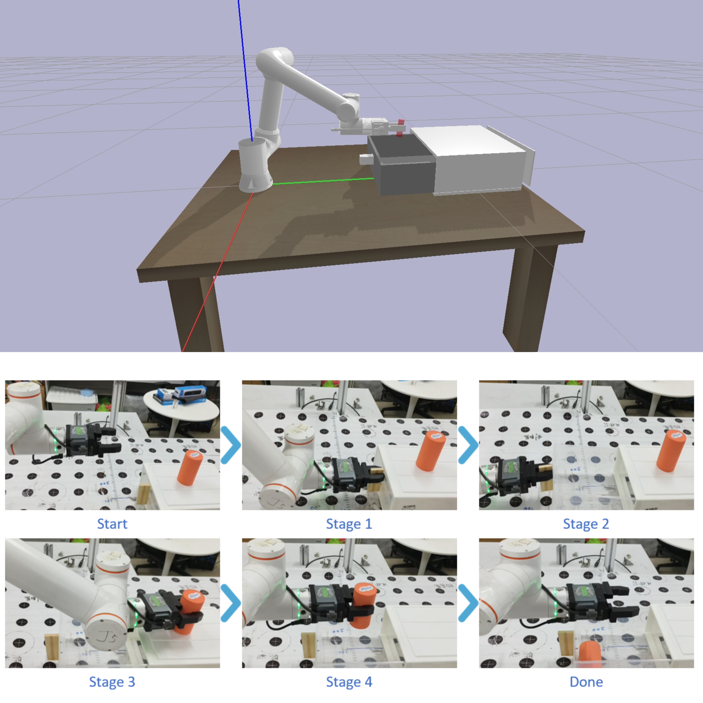
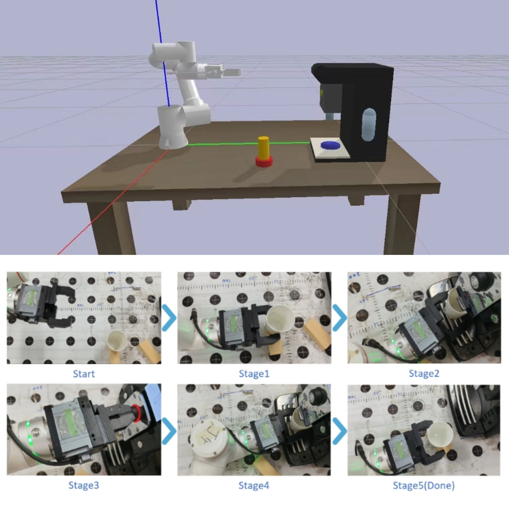

<h2 align="center">
    Long-Sequence-Reinforcement-Learning-with-Stage-Wise-Model-Fusion
</h2>
<!-- (ROBIO 2025)Long-Sequence Reinforcement Learning with Stage-Wise Model Fusion.  
The code will be open-sourced soon after it has been organized. -->

## 📖 Introduction
We propose a novel data sampling strategy that establishes an efficient training paradigm for long-term agent tasks through multi-stage model fusion, which notably operates without the need for human expert data. Specifically, our method first employs simple reinforcement learning to independently train meta-policies for each sub-task in simulation, designating them as teacher models. Subsequently, this acquired knowledge is effectively aggregated into a lightweight LSTM student model, empowering it to autonomously execute complex long-sequence tasks.

## 🔧 Scene Deployment
In this experiment, we used pybullet as the simulation platform to build two simulation environments, conducted model training in the simulation environments, and successfully deployed and ran the models on the real machine.
If the robotic arm encounters: (1) the gripper touches the target or table during motion, (2) the number of motion steps exceeds the limit, then it is judged as task failure. In both simulation and real scenarios, after each experiment, we will randomly reposition the target object.
#### Scene 1: Pull out the drawer to put things in.


#### Scene 2: Make a cup of coffee.


## 📚 Code Explanation
- fr5_description: Store the required URDF model files.
- Fr5_env.py: Construct the reinforcement learning environment.
- Fr5_train.py: Contain the reinforcement learning training code.
- Fr5_test.py/Fr5_test_2.py: Used for reinforcement learning testing.

## 🚀 Quick Start

You can achieve your desired result by referring to the following commands.

#### ⚙️ Install the requirements:
```
# create a virtual environment
conda create -n RL python=3.10
conda activate RL
# install the requirements
pip install -r requirements.txt
```

#### 🔥 Training
To train the model, run the following command:
```bash
python ./FR_Gym/Fr5_train.py
```

#### 🔍 Visualize
To visualize training results, run the following command:
```bash
tensorboard --logdir .../logs/PPO/your_training_results --port 6006
```

#### ⚔️ Testing
To test the model, run the following command:
```bash
python ./FR_Gym/test/Fr5_test.py
```
